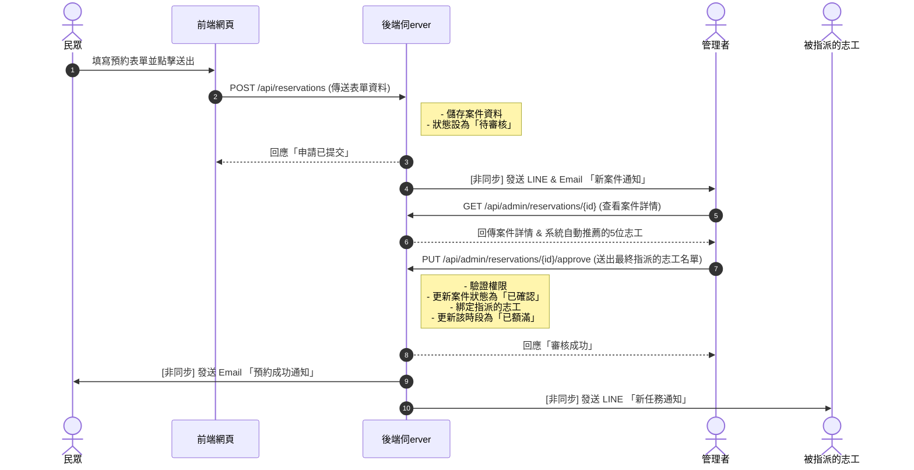
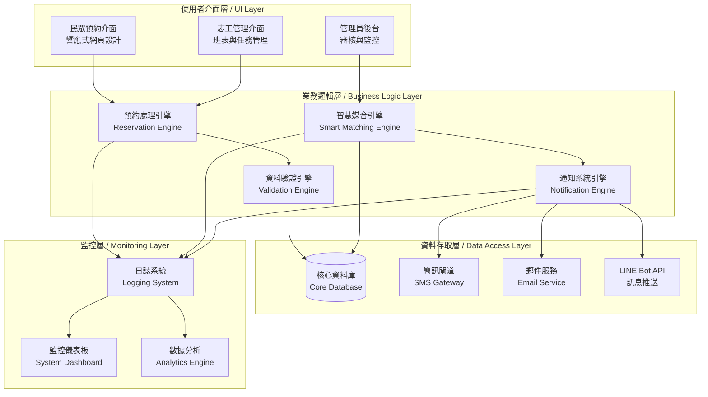
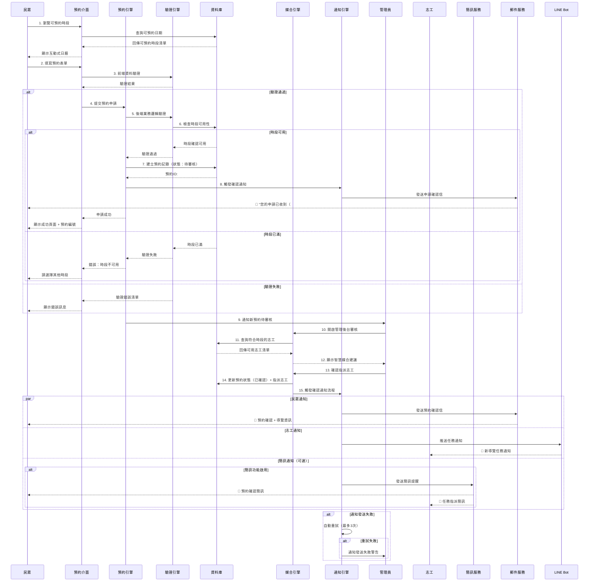
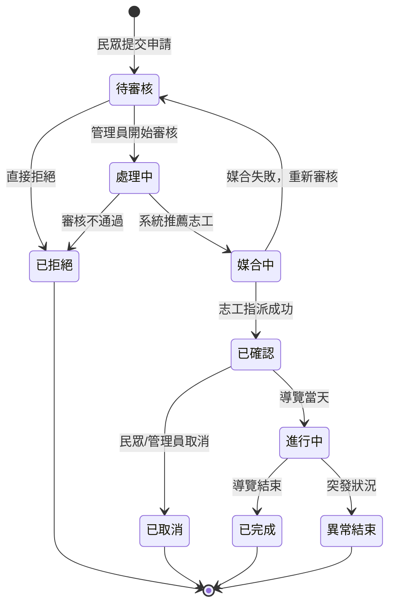
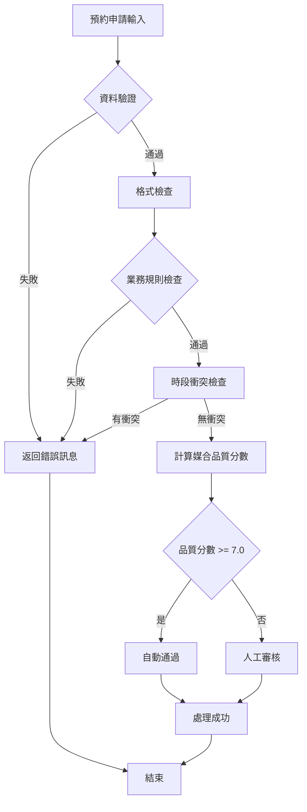

# 臺東縣消防局防災館預約系統

這是一個智慧化的防災館預約與志工媒合平台。

## 系統核心流程

下方是使用者從預約到收到通知的完整互動流程圖。

## 功能規格

本專案主要分為三大使用者端，各自擁有獨立的核心功能：

### 👨‍👩‍👧‍👦 民眾端功能 (Public-Facing)
- **互動式預約日曆**: 訪客可透過視覺化月曆，清楚查看可預約、已額滿及休館日期。
- **線上預約表單**: 訪客可填寫聯絡資訊、參觀人數、年齡層等，快速完成線上預約。
- **自動化 Email 通知**: 在預約提交後、審核成功後及參訪前，系統會自動寄送通知信件，確保資訊不漏接。

### 🙌 志工端功能 (Volunteer Portal)
- **志工儀表板**: 志工登入後可查看即將到來的導覽任務與個人化資訊。
- **班表管理系統**: 提供視覺化月曆，讓志工能輕鬆點選、更新自己可提供服務的時段。
- **服務時數統計**: 系統會自動累計並顯示服務時數，方便志工隨時查詢。
- **LINE 任務通知**: 當有新的導覽任務被指派時，系統會透過 LINE Bot 即時推播通知給志工。

### ⚙️ 管理員後台功能 (Admin Dashboard)
- **預約案件儀表板**: 集中管理所有預約案件，並可依狀態（待審核、已確認等）進行篩選與查詢。
- **智慧志工媒合**: 系統會根據預約的時段，從班表中自動推薦可服務的志工名單。
- **手動指派與管理**: 管理員保有最終決定權，可手動調整、指派或取消志工的任務。
- **志工資料管理**: 統一管理所有志工的個人檔案與歷史服務紀錄。

# 優化後防災館預約系統 PRD 與流程圖

## 系統架構優化

### 三層式架構設計

## 優化後完整預約流程

## 狀態管理優化流程

## 品質控制與監控機制

### 自動化驗證標準

### 系統監控指標

| 監控項目 | 目標值 | 警告閾值 | 監控頻率 |
|---------|--------|----------|----------|
| 預約成功率 | ≥ 95% | < 90% | 即時 |
| 媒合成功率 | ≥ 85% | < 80% | 即時 |
| 系統回應時間 | ≤ 2秒 | > 5秒 | 即時 |
| 通知送達率 | ≥ 98% | < 95% | 每小時 |
| 志工參與率 | ≥ 80% | < 70% | 每日 |

## 新增功能規格

### 4. 品質控制模組
- **自動驗證機制**: 預約資料完整性檢查、時段衝突偵測
- **媒合品質評估**: 志工能力與需求匹配度評分（0-10分）
- **異常處理**: 自動重試機制，最多3次重試
- **品質閾值**: 媒合品質分數低於7.0分需人工審核

### 5. 監控與分析模組
- **即時監控儀表板**: 系統狀態、處理量、錯誤率
- **數據分析報表**: 預約趨勢、志工績效、使用者滿意度
- **預警系統**: 異常狀況自動通知管理員
- **效能追蹤**: API回應時間、資料庫查詢效能

### 6. 進階通知系統
- **通知狀態追蹤**: Email/LINE/SMS送達確認
- **個人化通知偏好**: 使用者可自訂接收方式
- **批次通知處理**: 支援大量通知的批次發送
- **通知範本管理**: 可自訂各種通知的內容範本

### 7. 錯誤恢復機制
- **自動重試邏輯**: API失敗時指數退避重試
- **狀態回滾**: 異常情況下自動回滾到上一個穩定狀態
- **資料一致性**: 確保跨系統資料的一致性
- **災難恢復**: 定期備份與快速恢復機制

這個優化版本整合了現代系統設計的最佳實踐，提供更穩定、可擴展的防災館預約系統。
