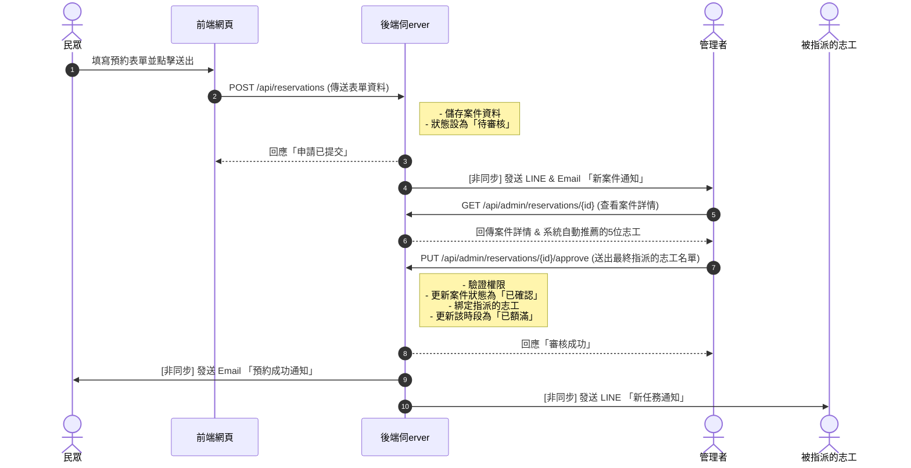

# 臺東縣消防局防災館預約系統

這是一個智慧化的防災館預約與志工媒合平台。

## 系統核心流程

下方是使用者從預約到收到通知的完整互動流程圖。

## 功能規格

本專案主要分為三大使用者端，各自擁有獨立的核心功能：

### 👨‍👩‍👧‍👦 民眾端功能 (Public-Facing)
- **互動式預約日曆**: 訪客可透過視覺化月曆，清楚查看可預約、已額滿及休館日期。
- **線上預約表單**: 訪客可填寫聯絡資訊、參觀人數、年齡層等，快速完成線上預約。
- **自動化 Email 通知**: 在預約提交後、審核成功後及參訪前，系統會自動寄送通知信件，確保資訊不漏接。

### 🙌 志工端功能 (Volunteer Portal)
- **志工儀表板**: 志工登入後可查看即將到來的導覽任務與個人化資訊。
- **班表管理系統**: 提供視覺化月曆，讓志工能輕鬆點選、更新自己可提供服務的時段。
- **服務時數統計**: 系統會自動累計並顯示服務時數，方便志工隨時查詢。
- **LINE 任務通知**: 當有新的導覽任務被指派時，系統會透過 LINE Bot 即時推播通知給志工。

### ⚙️ 管理員後台功能 (Admin Dashboard)
- **預約案件儀表板**: 集中管理所有預約案件，並可依狀態（待審核、已確認等）進行篩選與查詢。
- **智慧志工媒合**: 系統會根據預約的時段，從班表中自動推薦可服務的志工名單。
- **手動指派與管理**: 管理員保有最終決定權，可手動調整、指派或取消志工的任務。
- **志工資料管理**: 統一管理所有志工的個人檔案與歷史服務紀錄。
