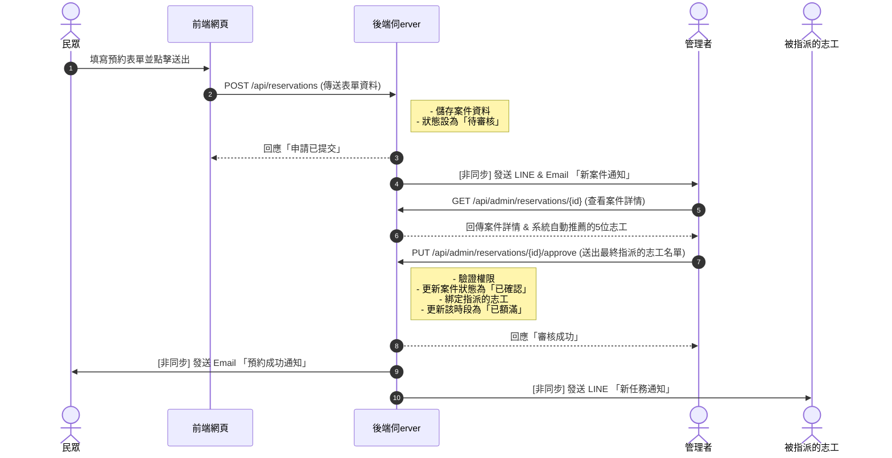

# 臺東縣消防局防災館預約系統

這是一個智慧化的防災館預約與志工媒合平台。

## 系統核心流程

下方是使用者從預約到收到通知的完整互動流程圖。

```mermaid
sequenceDiagram
    autonumber
    
    %% 使用別名 (Alias) 縮短參與者名稱
    actor User as 民眾
    participant FE as 前端網頁
    participant BE as 後端伺erver
    actor Admin as 管理者
    actor Volunteer as 被指派的志工

    %% --- 流程一：民眾提交預約 ---
    User->>FE: 填寫預約表單並點擊送出
    FE->>BE: POST /api/reservations (傳送表單資料)
    Note right of BE: - 儲存案件資料<br>- 狀態設為「待審核」
    BE-->>FE: 回應「申請已提交」
    BE->>Admin: [非同步] 發送 LINE & Email 「新案件通知」

    %% --- 流程二：管理者審核與指派 ---
    Admin->>BE: GET /api/admin/reservations/{id} (查看案件詳情)
    BE-->>Admin: 回傳案件詳情 & 系統自動推薦的5位志工
    
    Admin->>BE: PUT /api/admin/reservations/{id}/approve (送出最終指派的志工名單)
    Note right of BE: - 驗證權限<br>- 更新案件狀態為「已確認」<br>- 綁定指派的志工<br>- 更新該時段為「已額滿」
    BE-->>Admin: 回應「審核成功」

    %% --- 流程三：系統自動化通知 ---
    BE->>User: [非同步] 發送 Email 「預約成功通知」
    BE->>Volunteer: [非同步] 發送 LINE 「新任務通知」
```

## 功能規格

- 功能一...
- 功能二...
