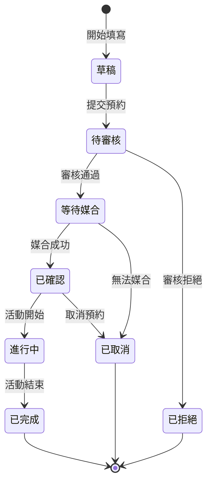
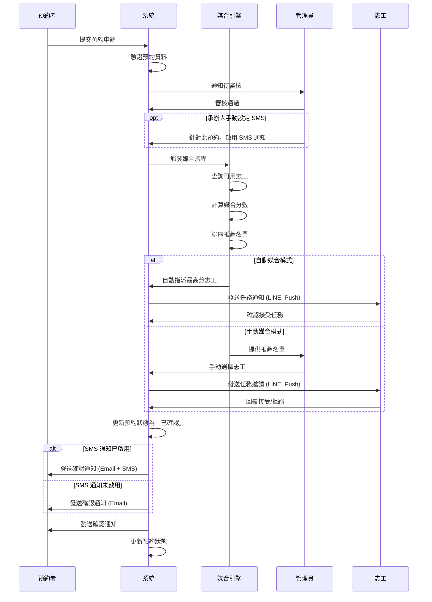

# 產品需求文件 (PRD): 臺東縣消防局防災館預約系統

**版本**: 2.0  
**最後更新日期**: 2025年9月23日  
**負責人**: Josh

## 目錄
1. [專案總覽](#專案總覽)
2. [系統架構](#系統架構)
3. [核心數據模型](#核心數據模型)
4. [功能規格](#功能規格)
5. [工作流程設計](#工作流程設計)
6. [非功能性需求](#非功能性需求)
7. [技術架構](#技術架構)
8. [品質控制標準](#品質控制標準)

## 專案總覽

### 1.1 專案目標
建置一個基於**事件驅動架構 (Event-Driven Architecture)** 的智慧媒合平台，透過自動化工作流程與狀態管理機制，解決防災館預約流程中的人工作業瓶頸。

### 1.2 核心價值主張
- **即時性**: 24/7 線上預約，即時狀態更新
- **智慧化**: 自動媒合演算法，最佳化志工派遣
- **可追溯**: 完整的狀態追蹤與歷史記錄
- **擴展性**: 模組化設計支援未來功能擴充

### 1.3 系統角色定義

| 角色          |   權限層級   |      核心職責     |          主要操作          |
|---------------|-------------|------------------|----------------------------|
|    **訪客**    |   Public   | 瀏覽資訊、提交預約 | 查看日曆、填寫表單、接收通知 |
|   **預約者**   | Registered |    管理個人預約    | 查詢狀態、修改預約、取消預約 |
|    **志工**    |  Volunteer |    管理服務時段    | 設定班表、接受任務、回報狀態 |
|   **管理員**   |    Admin    |    系統營運管理   | 審核預約、指派志工、數據分析 |
| **系統管理者** | Super Admin |      系統維護     | 參數設定、權限管理、系統監控 |

## 系統架構

### 2.1 架構設計原則
- **微服務架構**: 預約服務、媒合服務、通知服務獨立部署
- **事件驅動**: 採用事件匯流排進行服務間通訊
- **狀態機管理**: 明確定義預約生命週期狀態轉換
- **快取優先**: Redis 快取熱門查詢數據

### 2.2 系統組件架構

```
┌─────────────────────────────────────────────────────────────┐
│                     前端應用層 (Frontend)                    │
├──────────────┬──────────────┬──────────────┬────────────────┤
│   民眾入口    │   志工入口   │  管理後台      │   行動應用     │
└──────────────┴──────────────┴──────────────┴────────────────┘
                              │
┌─────────────────────────────────────────────────────────────┐
│                     API 閘道層 (API Gateway)                │
├─────────────────────────────────────────────────────────────┤
│            認證/授權 │ 流量控制 │ 路由分發 │ 監控             │
└─────────────────────────────────────────────────────────────┘
                              │
┌─────────────────────────────────────────────────────────────┐
│                    業務服務層 (Business Services)            │
├──────────────┬──────────────┬──────────────┬────────────────┤
│  預約服務     │  媒合引擎    │  通知服務     │     報表服務    │
│  (Booking)   │  (Matching)  │(Notification)│   (Analytics)  │
└──────────────┴──────────────┴──────────────┴────────────────┘
                              │
┌─────────────────────────────────────────────────────────────┐
│                    資料存取層 (Data Access Layer)            │
├──────────────┬──────────────┬──────────────┬────────────────┤
│  PostgreSQL  │    Redis     │  Elasticsearch│   S3 Storage  │
└──────────────┴──────────────┴──────────────┴────────────────┘
```

## 核心數據模型

### 3.1 預約狀態機 (Reservation State Machine)

```python
from enum import Enum

class ReservationStatus(Enum):
    """預約狀態定義"""
    DRAFT = "draft"                    # 草稿（未完成填寫）
    PENDING = "pending"                # 待審核
    AWAITING_VOLUNTEER = "awaiting"   # 等待志工媒合
    CONFIRMED = "confirmed"            # 已確認
    IN_PROGRESS = "in_progress"        # 進行中
    COMPLETED = "completed"            # 已完成
    CANCELLED = "cancelled"            # 已取消
    EXPIRED = "expired"                # 已逾期
    REJECTED = "rejected"              # 已拒絕

class VolunteerStatus(Enum):
    """志工狀態定義"""
    AVAILABLE = "available"            # 可服務
    ASSIGNED = "assigned"              # 已指派
    ON_DUTY = "on_duty"               # 服務中
    OFF_DUTY = "off_duty"             # 非服務時段
    LEAVE = "leave"                    # 請假中
```

### 3.2 核心資料結構

```typescript
 // 預約記錄
 interface Reservation {
     id: string;
     ...
     metadata: {
         source: 'web' | 'phone' | 'walk-in';
         createdAt: Date;
         updatedAt: Date;
         statusHistory: StatusChange[];
         // 新增 SMS 通知設定
         smsNotification?: { 
             enabled: boolean; // 是否啟用
             triggeredBy: string; // 操作人員 ID (管理員或其授權者)
             timestamp: Date; // 設定時間
         };
     };
     ...
 }

// 志工班表
interface VolunteerSchedule {
    volunteerId: string;
    availableSlots: TimeSlot[];
    assignedTasks: Task[];
    preferences: {
        maxTasksPerDay: number;
        preferredTimeSlots: TimeSlot[];
        blackoutDates: Date[];
    };
    statistics: {
        totalHours: number;
        completedTasks: number;
        rating: number;
    };
}

// 媒合結果
interface MatchingResult {
    reservationId: string;
    recommendedVolunteers: {
        volunteerId: string;
        matchingScore: number;
        availability: boolean;
        factors: {
            timeMatch: number;
            experienceMatch: number;
            preferenceMatch: number;
        };
    }[];
    autoAssigned: boolean;
    manualOverride?: {
        overriddenBy: string;
        reason: string;
        timestamp: Date;
    };
}
```

## 功能規格

### 4.1 民眾端功能模組

#### 4.1.1 智慧預約系統
- **動態時段管理**: 根據志工可用性即時更新可預約時段
- **衝突檢測**: 自動檢測並防止時段衝突
- **預約建議**: 基於歷史數據推薦最佳參觀時段
- **多語言支援**: 繁體中文、英文、日文介面

#### 4.1.2 預約追蹤系統
- **狀態即時更新**: WebSocket 推送狀態變更
- **歷史記錄查詢**: 完整的預約歷史與狀態變更記錄
- **評價回饋**: 參觀後評分與意見回饋機制

### 4.2 志工端功能模組

#### 4.2.1 智慧排班系統
- **彈性班表設定**: 支援重複性班表、臨時調整
- **任務負載平衡**: 自動平均分配任務避免過勞
- **偏好設定**: 設定服務時段偏好、每日任務上限
- **請假管理**: 線上請假申請與代理人安排

#### 4.2.2 任務管理中心
- **任務詳情**: 查看參觀團體資訊、特殊需求
- **任務交接**: 支援任務轉移給其他志工
- **服務記錄**: 自動計算服務時數、生成證明

### 4.3 管理後台功能模組

#### 4.3.1 營運儀表板
- **即時監控**: 預約狀態、志工在線狀況、系統負載
- **KPI 追蹤**: 預約轉換率、志工利用率、服務滿意度
- **異常告警**: 自動偵測異常狀況並通知

#### 4.3.2 智慧媒合引擎
```python
class MatchingEngine:
    """志工媒合引擎"""
    
    def calculate_matching_score(self, reservation, volunteer):
        """計算媒合分數"""
        score = 0
        
        # 時段匹配度 (40%)
        time_match = self.calculate_time_match(
            reservation.time_slot, 
            volunteer.available_slots
        )
        score += time_match * 0.4
        
        # 經驗匹配度 (30%)
        experience_match = self.calculate_experience_match(
            reservation.group_type,
            volunteer.experience
        )
        score += experience_match * 0.3
        
        # 負載平衡 (20%)
        load_balance = self.calculate_load_balance(
            volunteer.current_tasks
        )
        score += load_balance * 0.2
        
        # 偏好匹配 (10%)
        preference_match = self.calculate_preference_match(
            reservation,
            volunteer.preferences
        )
        score += preference_match * 0.1
        
        return score
```

+ #### 4.3.3 通知管理系統
+ - **手動 SMS 發送控制**: 在管理後台提供操作介面，允許「管理員」(承辦人) 或其授權同仁，針對單筆或多筆預約手動開啟或關閉 SMS 通知的發送。此設定將決定下方的通知管道是否啟用 SMS。
+ 
+ | 通知類型 | 觸發條件 | 接收對象 | 通知管道 |
+ |---------|---------|---------|---------|
+ | 預約確認 | 預約提交成功 | 預約者 | Email, SMS (可選) |
+ | 審核結果 | 管理員審核完成 | 預約者 | Email, LINE |
+ | 任務指派 | 媒合成功 | 志工 | LINE, Push |
+ | 行前提醒 | 參觀前24小時 | 預約者、志工 | Email, SMS (可選), LINE |
+ | 狀態變更 | 任何狀態改變 | 相關人員 | 根據設定 |

## 工作流程設計

### 5.1 預約處理工作流程



### 5.2 志工媒合工作流程



## 非功能性需求

### 6.1 性能要求
- **響應時間**: API 響應 < 200ms (P95)
- **並發處理**: 支援 1000 並發用戶
- **可用性**: 99.9% SLA
- **資料備份**: 每日自動備份，RPO < 1小時

### 6.2 安全要求
- **身份驗證**: OAuth 2.0 / JWT
- **資料加密**: TLS 1.3 傳輸加密
- **敏感資料**: AES-256 加密存儲
- **審計日誌**: 所有操作留存記錄

### 6.3 可用性要求
- **響應式設計**: 支援手機、平板、桌面
- **無障礙標準**: WCAG 2.1 Level AA
- **瀏覽器支援**: Chrome, Safari, Firefox, Edge (最新兩個版本)
- **離線功能**: Service Worker 支援基本離線瀏覽

## 技術架構

### 7.1 技術選型

| 層級 | 技術選擇 | 理由 |
|-----|---------|------|
| 前端框架 | Next.js 14 + TypeScript | SSR/SSG、型別安全、SEO 優化 |
| 狀態管理 | Zustand + React Query | 輕量級、快取管理 |
| UI 組件 | Ant Design + Tailwind CSS | 企業級組件、客製化彈性 |
| 後端框架 | NestJS + TypeScript | 模組化、依賴注入、型別安全 |
| 資料庫 | PostgreSQL + Redis | ACID、快取層 |
| 訊息佇列 | RabbitMQ | 可靠性、延遲任務 |
| 監控 | Prometheus + Grafana | 指標收集、視覺化 |

### 7.2 部署架構

```yaml
# Docker Compose 配置示例
version: '3.8'
services:
  frontend:
    image: fire-station-frontend:latest
    ports:
      - "3000:3000"
    environment:
      - API_URL=http://api:4000
  
  api:
    image: fire-station-api:latest
    ports:
      - "4000:4000"
    depends_on:
      - postgres
      - redis
    environment:
      - DATABASE_URL=postgresql://...
      - REDIS_URL=redis://redis:6379
  
  postgres:
    image: postgres:15
    volumes:
      - postgres_data:/var/lib/postgresql/data
  
  redis:
    image: redis:7-alpine
    volumes:
      - redis_data:/data
```

## 品質控制標準

### 8.1 測試策略
- **單元測試覆蓋率**: > 80%
- **整合測試**: 關鍵流程 100% 覆蓋
- **E2E 測試**: 主要用戶旅程
- **負載測試**: 模擬高峰期流量

### 8.2 監控指標

| 指標類別 | 監控項目 | 閾值 | 告警條件 |
|---------|---------|------|---------|
| 系統健康 | CPU 使用率 | < 70% | > 80% 持續 5 分鐘 |
| 系統健康 | 記憶體使用率 | < 80% | > 90% |
| 業務指標 | 預約成功率 | > 90% | < 85% |
| 業務指標 | 志工媒合率 | > 95% | < 90% |
| 用戶體驗 | 頁面載入時間 | < 2s | > 3s |
| 用戶體驗 | API 錯誤率 | < 1% | > 2% |

### 8.3 發布管理
- **藍綠部署**: 零停機時間部署
- **特徵開關**: 漸進式功能發布
- **回滾機制**: 一鍵回滾到前一版本
- **發布週期**: 雙週迭代發布

## 附錄

### A. API 端點規範
詳見 API 文檔：`/docs/api-specification.md`

### B. 資料庫架構
詳見資料庫設計：`/docs/database-schema.md`

### C. 安全規範
詳見安全指南：`/docs/security-guidelines.md`
